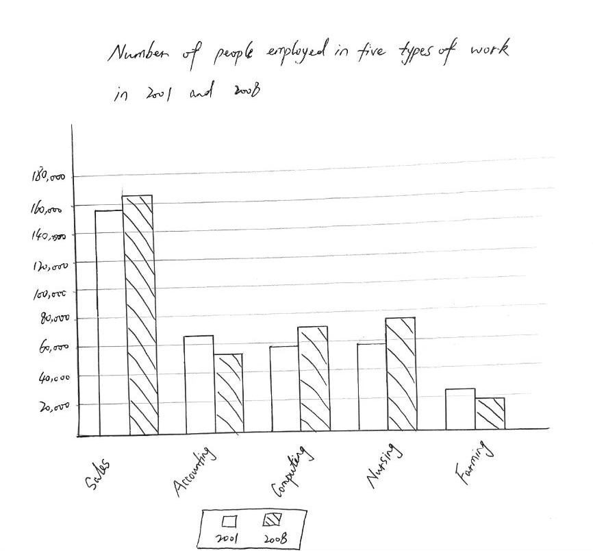

### Question

***The chart below shows the qualification of the workforce at an engineering company in 1988 and 2008.***

### Solution

The bar chart shows how many employees were **recrui****ted** in five categories of work in one region of Australia. Two **historical** years, 2001 and 2008, are **investigated**. 

The **realm** of sales **draw**s **immediate** **attention**, as the largest number of people chose to work as a sales representative in both 2001 and 2008, with 155,000 and 165,000 respectively. **Likewise**, starting at approximately 60,000, both the numbers of staff in the fields of computing and nursing experienced growths. Specifically, one rose moderately by 10,000, while the other grew significantly to nearly 80,000. 

As for the remaining types of work, there were 65,000 **accountant**s in 2001, almost three times as many as farmers. Afterwards, the year of 2008 saw a fall in both two categories, with the figures decreasing by 10,000 and 5,000 respectively. It is also worth mentioning that farmers were always the least **sought-after profession**.

Overall, the difference between the two years varied from sector to **sector**, and the high employment rate in sales **stands out**.

